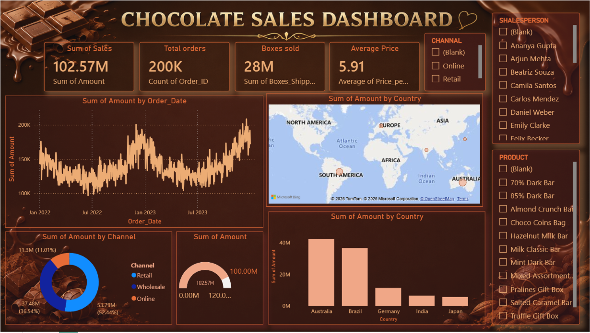

# 🍫 Chocolate Sales Dashboard

## 📌 Overview

This project is an interactive **Chocolate Sales Dashboard** built using **Microsoft Power BI**. It helps analyze sales performance through KPIs and interactive visualizations, making it easier to identify trends and support business decisions.

## 📊 Dashboard Preview

> Add your dashboard screenshot here.

## 🚀 Features

- 💰 Total Sales
- 📦 Total Orders
- 🍫 Total Boxes Sold
- 💵 Average Price per Box
- 📢 Marketing Spend
- 📈 Monthly Sales Trend
- 🌍 Sales by Country
- 🍫 Top Selling Products
- 🥧 Sales by Sales Channel
- 🗺️ Sales Map
- 👤 Top Salesperson
- 🎯 Interactive Slicers

## 🛠️ Tools Used

- Microsoft Power BI
- Power Query
- DAX
- Microsoft Excel

## 📂 Dataset

The dataset contains **200,000+ sales records** with the following fields:

- Order ID
- Product
- Country
- Salesperson
- Sales Channel
- Order Date
- Amount
- Boxes Shipped
- Price per Box
- Discount
- Marketing Spend

---

## 📈 Key Insights

- Identified top-performing countries by sales.
- Analyzed monthly sales trends.
- Compared product-wise sales performance.
- Evaluated sales channel contribution.
- Tracked marketing spend and overall sales.
- Built an interactive dashboard with slicers for dynamic filtering.

## 🎯 Skills Demonstrated

- Data Cleaning
- Data Modeling
- Power Query
- DAX
- Dashboard Design
- Business Intelligence
- Data Visualization

## 📌 Project Outcome

This dashboard provides a clear view of chocolate sales performance, helping businesses monitor KPIs, analyze trends, and make data-driven decisions.

## 👩‍💻 Author

**Harshita Kushwaha**

- LinkedIn: https://www.linkedin.com/in/harshita-kushwaha-28063a333

---

⭐ If you like this project, consider giving it a Star!
